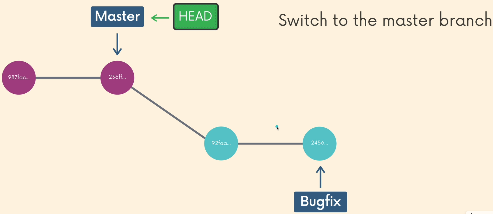
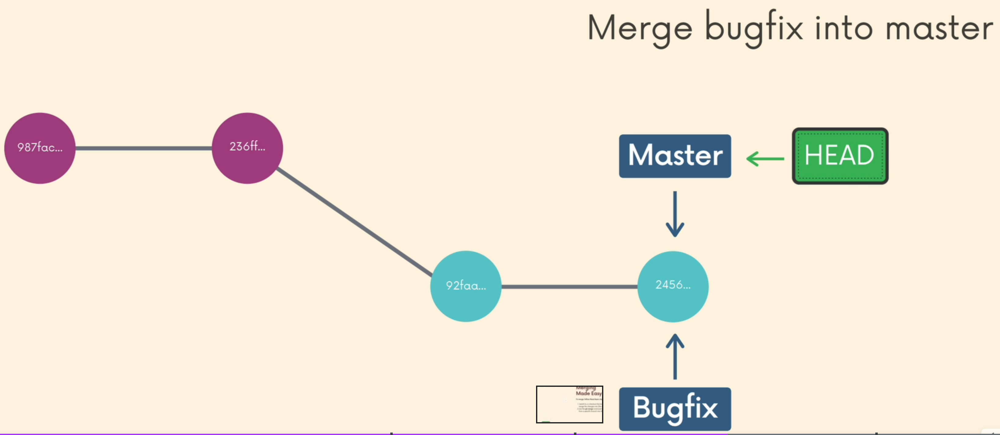
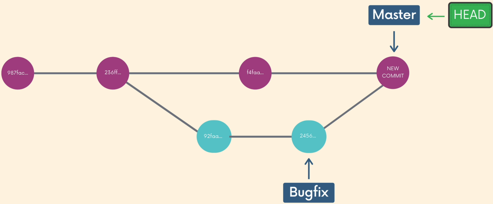

# **Udemy Tutorial - The Git & Github Bootcamp ***Colt Steele*****

## **Introducing Git**
The world's most popular version control system. It is a free and open source distributed version control system designed to handle everything from small to very large projects with speed and effciency.
- What exactly is version control?
  - It is software that tracks and manages changes to files over time.
  - It generally allow users to revisit earlier versions of the files, compare changes between versions, undo changes, and a whole lot more.
- Git features
  - Track changes across multiple files
  - Compare versions of a project
  - "Time travel" back to old versions
  - Revert to a previous version
  - Collaborate and share changes
  - Combine changes
- A quick history of Git
  - ***Linus Torvalds*** is the creator and main developer behind Linux and Git!
  - Git development began in April 2005, after many developers of the Linux Kernel gave up access to BitKeeper, a proprietary source-control management (SCM) system that they had been using to maintain the project since 2002.
  - On April 3rd 2005 he got to work on his own VCS, which would become Git. In a matter of days he had most basic functionality done.
  - The first official Git release came a couple months later. 15 years later in 2020, over 90% of developers worldwide use Git on a daily basis!
  - He referred to Git as "the stupid content tracker" while he was working on it. Eventually he settled on the name Git which means "unpleasant persion" in British Snglish slang.
- Who use Git?
  - Engineers and Coders
  - Tech-Adjacent Roles
  - Governments
  - Scientists
  - Writers
  - Anyone
- Git vs Github

    | 

     | 

        |
    |:---                                                                         |                                                                               :---|
    |Git is the version control software that runs locally on your machine.You don't need to register for an account. You don't need the internet to use it. You can use Git without ever touching Github.                                         |Github is a service that hosts Git repositories in the cloud and makes it easier to collaborate with other people. You do need to sign up for an account to use Github. It's an online place to share work that is done using Git.                    |

## **Installation & Setup**
- Windows /macOS /Linux Git installation
  - [Download for Windows /macOS /Linux ](https://git-scm.com/downloads)

- Configuring You Git Name & Email
  - Checking user name: `$ git config user.name`
  - Checking user email: `$ git config user.email`
  - Configuring user name: `$ git config --global user.name Bruce Lee`
  - Configuring user name: `$ git config --global user.email bruceLee@gmail.com

## **The Very Basics of Git: Adding & Committing**
- Repositiory is a workspace which tracks and manages files within a folder.
- **git status** gives information on the current status of a git repository and its contents `$ git status`
- Use **git init** to create a new git repository. Before we can do anything git-related, we must initialize a repo first! `$ git init`
- Warning: Do not init a repo inside of a repo!
- The basic Git workflow
  |Work On Stuff|Add Changes|Commit|
  |:---         |:---       |:---  |
  |Make new files, edit files, delete files, etc|Group specific changes together, in preparation of committing|Commit everything that was previously added|
- Use **git add** specific files to the staging area. Separate files with spaces to add multiple at once. `$ git add file1 file2`
- We use the **git commit** command to actually commit changes from the staging area. The `-m` flag allows us to pass in an inline commit message, rather than launching a text editor. `$ git commit -m "my first commit"`
- Use **git add .** to stage all changes at once. `$ git add .`
- Git docs recommend use present tense. But past tense also good and make sense.
- Running `git commit` will commit all staged changes. It also opens up a text editor and prompts you for a commit message.
- Showing every first line of log `git log --oneline`
- Amending commit can correct **just one commit message ago**. Use `git commit --amend` and directly modify it by editor.
- We can tell Git which files and directories to ignore in a given repository, using a **.gitignore** file. Inside the file, we can write patters to tell Git which files & folders to ignore:
  - .DS_Store will ignore files named .DS_Store
  - folderName/ will ignore an entire directory
  - *.log will ignore any files with the .log extension

##  **Working With Branches**
- Braches enable us to create separate contexts where we can try new things, or even work on multiple ideas in parallel.
- The default branch name of Git is **master** that doesn't do anything special or have fancy powers. Github renamed the default branch from master to main.
- **HEAD** is simply a pointer that refers to the current "location" in your repository. It points to a particular branch reference.
- Use **git branch** to view your existing branches.
- Use **git branch <branch-name>** to make a new branch based upon the current HEAD but it won't move to the branch.
- Use **git switch <branch-name>** or **git checkout <branch-name>** to switch to it.
- Use **git switch** with the **-c** flag to create a new branch and switch to it all in one go. Or use **git branch -b <branch-name>**
- **-d** for deleting a branch. The branch must be fully merged in its upstream branch. **-D** is shortcut for **--delete --force**. If you delete a branch you have to HEAD any branch but not the branch.
- **-m** for move/rename a branch and the corresponding reflog. **-M** is shortcut for **--move --force**. If you rename a branch but you have to HEAD the branch.
- To merge, follow these basic steps:
  - Switch to or checkout the branch you want to merge the changes into (the receiving branch) `git switch master`
  
    

  
  - Use the git merge command to merge changes from a specific branch into the current branch. `git merge specific_branch`
    
    

  - Rather than performing a simple fast forward, git performs a "merge commit". We end up with a new commit on the master branch.
  
    

  
- Resolving Conflicts:
  1. Open up the file(s) with merge conflicts
  2. Edit the file(s) to remove the conflicts. Decide which branch's content you want to keep  in each conflict. Or keep the content from both.
  3. Remove the conflict "markers" in the document
  4. Add your changes and then make a commit!

## Comparing Changes With Git Diff
- We can use the **git diff** command to view changes between commits, branches, files, our working directory, and more! Compares staging area and working direcotyr.
- **git diff HEAD** lists all changes in the working tree since your last commit.
- **git diff --staged** or **--cached** will list the changes between the staging area and our last commit.
- We can view the changes within a specific file by providing git diff with a filename. **git diff HEAD [filename]** or **git diff --staged [filename]** 
- **git diff branch1..branch2** will list the changes between the tips of branch1 and branch2.
  
